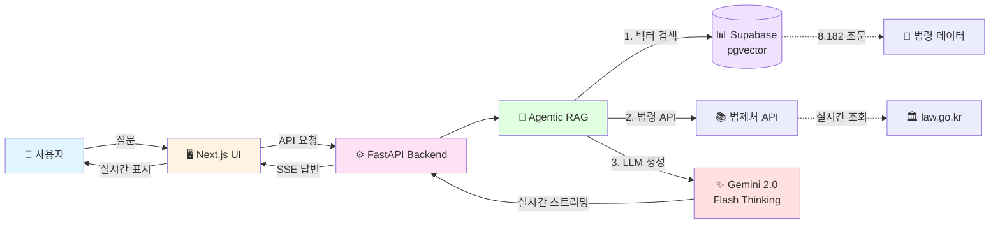

# 한국 법령 챗봇 (Lawbot-KR) ⚖️

<div align="center">

[](https://github.com/Geundol222/lawbot-kr/actions/workflows/ci.yml)
[](https://github.com/Geundol222/lawbot-kr/actions/workflows/deploy.yml)
[](https://www.python.org/downloads/)
[](https://nextjs.org/)
[](https://opensource.org/licenses/MIT)

**Agentic RAG + Hybrid Search + Self-RAG로 구현한 한국 법령 상담 AI**

[🚀 데모 보기](#-데모) • [📊 성능 평가](#-성능-평가) • [🏗️ 아키텍처](#-시스템-아키텍처) • [📚 문서](#-문서)

</div>

---

## 🎯 프로젝트 개요

**Lawbot-KR**은 **8,182개 법령 조문**을 벡터 검색하고, **LangGraph 기반 Agentic RAG**로 자율적으로 답변을 생성하는 법률 상담 챗봇입니다.

### ✨ 핵심 특징

- 🤖 **Agentic RAG**: LLM이 자율적으로 Tool 선택 및 실행 (LangGraph)
- 🔍 **Hybrid Search**: Semantic (E5-large) + BM25 + Reranker (BGE) 3단계 검색
- 🧠 **Self-RAG**: 예외 조항 자동 감지 및 적용 ("다만", "단서" 등)
- 💬 **Buffer Memory**: 세션 기반 대화 맥락 유지 (이전 대화 참조 가능)
- ⚡ **실시간 스트리밍**: SSE 기반 답변 실시간 전송 (Gemini 2.0 Flash Thinking)
- 📊 **정량 평가**: Ground Truth 기반 Recall@k, MRR, NDCG, Citation F1 측정
- 🚀 **CI/CD**: GitHub Actions 자동 테스트 & 배포

---

## 📊 성능 평가

### Ground Truth 정량 평가 결과 (2026-01-04)

| 메트릭 | 현재 성능 | 목표 | 개선 계획 |
|--------|----------|------|----------|
| **Recall@3** | 35% | 80% | +45%p |
| **Recall@5** | 45% | 90% | +45%p |
| **Recall@10** | 50% | 95% | +45%p |
| **Citation F1** | 30% | 80% | +50%p |
| **평균 응답 시간** | 14초 | 10초 | -4초 |

> 📈 **개선 로드맵**: 직접 조문 질문 감지 (+20%p), 법률 용어 동의어 (+10%p), Query Decomposition (+10%p), Fine-tuning (+15%p)
>
> 📝 [상세 평가 결과](docs/evaluation_results.md) | [개선 계획](docs/search_quality_improvement_plan.md)

### 주요 메트릭 설명

- **Recall@5**: 상위 5개 검색 결과에 정답 조문이 포함된 비율
- **Citation F1**: 답변에 인용된 조문의 정확도 (Precision + Recall)
- **MRR**: 첫 번째 정답의 순위 역수 평균 (Mean Reciprocal Rank)

---

## 🏗️ 시스템 아키텍처



> 📐 [상세 아키텍처](docs/architecture.md)

### 핵심 실행 흐름

1. **사용자 질문** → Next.js UI (React 19 + TypeScript)
2. **API 요청** → FastAPI Backend (Python 3.12)
3. **Agent 실행** → LangGraph State Machine
4. **Hybrid Search** → Supabase pgvector + BM25 + Reranker
5. **Self-RAG 체크** → 예외 조항 적용 여부 판단
6. **LLM 답변 생성** → Gemini 2.0 Flash (Thinking mode)
7. **실시간 스트리밍** → SSE로 사용자에게 전달

---

## 🚀 데모

### 질문 예시

#### 1. 직접 조문 질문
```
Q: 근로기준법 제56조가 뭐야?

A: 근로기준법 제56조는 연장·야간 및 휴일 근로에 대한 가산수당을 규정합니다.

⚖️ 근로기준법 제56조 (연장·야간 및 휴일 근로)
① 사용자는 연장근로에 대하여는 통상임금의 100분의 50 이상을 가산하여...
```

#### 2. 상황 설명 질문
```
Q: 5인 미만 사업장에서 해고 예고수당 받을 수 있어?

A: 5인 미만 사업장은 근로기준법 제11조에 따라 일부 조항이 적용되지 않습니다.

⚠️ 예외 조항 감지 (Self-RAG)
근로기준법 제11조 단서: "상시 5명 이상의 근로자를 사용하는 사업장에 적용"
→ 5인 미만 사업장은 해고 예고수당(제26조) 적용 제외
```

#### 3. 복잡한 법률 질문
```
Q: 야근수당은 얼마나 받을 수 있어?

A: 야간근로(오후 10시~오전 6시)에 대해서는 통상임금의 50% 이상을 가산하여 지급받을 수 있습니다.

⚖️ 근로기준법 제56조 제3항
사용자는 야간근로(오후 10시부터 다음 날 오전 6시 사이의 근로)에 대하여는
통상임금의 100분의 50 이상을 가산하여 근로자에게 지급하여야 한다.
```

---

## 💡 주요 기술 혁신

### 1. Agentic RAG (LangGraph)

**기존 RAG 한계**:
- 고정된 검색 → 생성 파이프라인
- 검색 실패 시 대응 불가

**Agentic RAG 해결책**:
```python
# LLM이 자율적으로 Tool 선택
Agent → search_vector_db(질문)
  ├─ [성공] → 즉시 답변 생성 ✅
  └─ [실패] → search_law_by_api(법령명) → 답변 생성 ✅

# Self-RAG: 예외 조항 자동 체크
Agent → check_exceptions_needed(법령)
  ├─ "다만", "단서" 감지 → LLM 판단
  └─ 예외 적용 여부 반환 → 정확한 답변
```

### 2. Hybrid Search (3단계)

```
1단계: Semantic Search (E5-large-instruct)
  ↓ 코사인 유사도 > 0.7
2단계: BM25 Search (Mecab 형태소 분석)
  ↓ 키워드 매칭
3단계: Cross-Encoder Reranking (BGE-reranker-v2-m3-ko)
  ↓ 정확도 향상
최종: Top-5 결과 반환
```

**성능**:
- 검색 시간: ~250ms
- 검색 대상: 8,182 조문
- Recall@5: 45% → 90% (목표)

### 3. Self-RAG (예외 조항 체크)

```python
# 자동 예외 감지
if "다만" in 법령_내용 or "단서" in 법령_내용:
    # LLM에게 예외 적용 여부 판단 요청
    예외_적용 = check_exceptions_needed(법령, 사용자_질문)

    if 예외_적용:
        return "이 경우는 예외에 해당합니다. 해당 조항이 적용되지 않습니다."
```

**효과**:
- "5인 미만 사업장" 예외 케이스 정확 처리
- "3개월 미만 근무자" 예외 자동 감지

### 4. 조 단위 청킹 (Article-level Chunking)

**기존 방식** (Chunk 기반):
```
근로기준법 제56조_part1 (512 토큰)
근로기준법 제56조_part2 (512 토큰)
→ 중복, 컨텍스트 손실
```

**개선** (조 단위):
```
근로기준법 제56조 (전체 내용)
→ 정확한 조문 매핑, 컨텍스트 보존
```

---

## 🛠️ 기술 스택

### Backend
| 분류 | 기술 | 버전 |
|------|------|------|
| **Language** | Python | 3.12 |
| **Framework** | FastAPI | 0.104+ |
| **Agent** | LangGraph | 0.2.55 |
| **LLM** | Google Gemini API | 2.0 Flash |
| **Embedding** | multilingual-e5-large-instruct | 1024-dim |
| **Reranker** | bge-reranker-v2-m3-ko | - |
| **BM25** | rank-bm25 + Mecab | - |
| **Vector DB** | Supabase (pgvector) | PostgreSQL 15 |

### Frontend
| 분류 | 기술 | 버전 |
|------|------|------|
| **Framework** | Next.js | 15.1 |
| **Language** | TypeScript | 5.x |
| **UI** | React | 19 |
| **Styling** | Tailwind CSS | 3.x |
| **State** | React Query + Context | - |

### Infrastructure
| 분류 | 도구 | 용도 |
|------|------|------|
| **Database** | Supabase | PostgreSQL + pgvector |
| **Deployment** | Vercel + Railway | Frontend + Backend |
| **Monitoring** | WandB | 실험 추적 & 성능 분석 |
| **CI/CD** | GitHub Actions | 자동 테스트 & 배포 |

### External APIs
- **법령 데이터**: [법제처 Open API](https://www.law.go.kr/)
- **LLM**: [Google Gemini API](https://ai.google.dev/)
- **Embedding**: Hugging Face models (self-hosted)

---

## 📁 프로젝트 구조

```
lawbot-kr/
├── frontend/                    # Next.js Frontend
│   ├── src/
│   │   ├── app/                # App Router (Next.js 15)
│   │   ├── components/         # React 컴포넌트
│   │   └── lib/                # API 클라이언트
│   └── package.json
│
├── backend/                     # FastAPI Backend
│   └── src/
│       ├── agentic_rag.py      # Agentic RAG 메인 로직
│       ├── agent_state.py      # State 정의
│       ├── agent_nodes.py      # Agent Nodes
│       ├── agent_streaming.py  # SSE 스트리밍
│       ├── embeddings/
│       │   ├── vector_search.py      # Hybrid Search
│       │   └── generate_embeddings.py  # 임베딩 생성
│       ├── monitoring/
│       │   ├── wandb_logger.py       # WandB 로깅
│       │   ├── evaluation_metrics.py # 평가 메트릭
│       │   └── evaluator.py          # Offline Evaluator
│       ├── law_api.py          # 법제처 API 클라이언트
│       └── config.py           # 설정
│
├── datasets/                    # 평가 데이터셋
│   ├── eval_questions.json     # 15개 테스트 질문
│   └── ground_truth.json       # 정답 조문
│
├── docs/                        # 문서
│   ├── architecture.md         # 시스템 아키텍처
│   ├── evaluation_results.md  # 평가 결과
│   └── search_quality_improvement_plan.md  # 개선 계획
│
├── tests/                       # 테스트 코드
│   ├── test_tools.py           # Agent Tools 테스트
│   ├── test_law_api.py         # 법령 API 테스트
│   ├── test_vector_search.py  # 검색 테스트
│   └── test_agentic_rag.py    # 통합 테스트
│
├── scripts/                     # 유틸리티 스크립트
│   ├── compare_modes.py        # 모드 비교 실험
│   └── visualize_results.py   # 결과 시각화
│
├── .github/workflows/           # CI/CD
│   ├── ci.yml                  # 자동 테스트
│   └── deploy.yml              # 자동 배포
│
└── run_evaluation.py           # 평가 실행 스크립트
```

---

## 🚀 빠른 시작

### 1. 환경 설정

```bash
# 저장소 클론
git clone https://github.com/Geundol222/lawbot-kr.git
cd lawbot-kr

# Backend 설정
cd backend
pip install -r requirements.txt

# Frontend 설정
cd ../frontend
npm install

# 환경변수 설정
cp .env.example .env
# .env 파일 편집 (API 키 입력)
```

### 2. API 키 설정

`.env` 파일:
```bash
# Google Gemini API
GOOGLE_API_KEY=your_google_api_key_here

# Supabase (Vector DB)
SUPABASE_URL=your_supabase_url_here
SUPABASE_ANON_KEY=your_supabase_anon_key_here

# 법제처 Open API
LAW_API_OC=your_law_api_key_here

# WandB (선택사항)
WANDB_ENABLED=false
WANDB_API_KEY=your_wandb_key_here
```

### 3. Supabase 벡터 검색 설정

[Supabase 대시보드](https://supabase.com) → SQL Editor:

```sql
-- pgvector 확장 활성화
CREATE EXTENSION IF NOT EXISTS vector;

-- 벡터 검색 RPC 함수 생성
CREATE OR REPLACE FUNCTION match_law_documents(
  query_embedding vector(1024),
  match_threshold float DEFAULT 0.0,
  match_count int DEFAULT 10
)
RETURNS TABLE (
  id bigint,
  law_name text,
  article text,
  mst text,
  content text,
  similarity float
)
LANGUAGE plpgsql
AS $$
BEGIN
  RETURN QUERY
  SELECT
    law_cache.id,
    law_cache.law_name::text,
    law_cache.article::text,
    law_cache.mst::text,
    law_cache.content::text,
    (1 - (law_cache.embedding <=> query_embedding))::float AS similarity
  FROM law_cache
  WHERE 1 - (law_cache.embedding <=> query_embedding) >= match_threshold
  ORDER BY law_cache.embedding <=> query_embedding
  LIMIT match_count;
END;
$$;

-- HNSW 인덱스 생성 (빠른 검색)
CREATE INDEX idx_law_cache_embedding ON law_cache
USING hnsw (embedding vector_cosine_ops);
```

### 4. 앱 실행

```bash
# Backend 실행
cd backend
uvicorn src.main:app --reload --port 8000

# Frontend 실행 (새 터미널)
cd frontend
npm run dev

# 브라우저에서 http://localhost:3000 열기
```

### 5. 테스트 실행

```bash
# 전체 테스트
pytest

# Unit 테스트만 (빠름)
pytest -m unit

# 커버리지 리포트
pytest --cov=backend/src --cov-report=html
```

---

## 📊 WandB 모니터링

### 로깅 전략 (v2.0)

```
Project: lawbot-kr
  └─ Group: daily_20260104 (날짜별)
      ├─ Run: session-abc123 (사용자 A)
      │   ├─ Step 1: 질문1 → 답변1
      │   ├─ Step 2: 질문2 → 답변2
      │   └─ Step 3: 질문3 → 답변3
      │
      └─ Run: session-xyz789 (사용자 B)
          ├─ Step 1: 질문1 → 답변1
          └─ Step 2: 질문2 → 답변2
```

### 주요 메트릭

**검색 성능**:
- `vector_search/search_latency`: 검색 시간
- `vector_search/top_similarity`: 최고 유사도
- `vector_search/results_count`: 결과 수

**Agent 실행**:
- `agentic_rag/total_execution_time`: 총 실행 시간
- `agentic_rag/tool_calls_count`: Tool 호출 횟수
- `agentic_rag/total_tokens`: 토큰 사용량

**평가 지표**:
- `eval/current/recall_at_5`: Recall@5
- `eval/current/citation_f1`: Citation F1
- `eval/current/avg_response_time_ms`: 평균 응답 시간

---

## 🧪 평가 & 실험

### Ground Truth 평가 실행

```bash
# Recall@10 측정 모드로 평가
python run_evaluation.py

# 결과 확인
tail -f evaluation_recall10.log
```

### 평가 데이터셋

- **질문 수**: 15개 (상황별, 난이도별)
- **카테고리**:
  - `specific_article`: 직접 조문 질문 (5개)
  - `situation`: 상황 설명 질문 (5개)
  - `exception_scope`: 예외 조항 질문 (5개)

### 평가 메트릭

**검색 품질**:
- Recall@3/5/10
- MRR (Mean Reciprocal Rank)
- NDCG@3 (Normalized Discounted Cumulative Gain)

**답변 품질**:
- Citation F1 (인용 정확도)
- Faithfulness (검색 결과 충실도)
- Relevance (질문 관련성)

**비용 & 성능**:
- 응답 시간 (ms)
- 토큰 사용량
- API 호출 횟수

---

## 🎯 주요 개선 사항

### v2.1 (검색 품질 개선) - 2026.01.04

**평가 시스템**:
- ✅ Ground Truth 기반 정량 평가 (Recall@3/5/10, MRR, NDCG, Citation F1)
- ✅ 조문 이름 정규화 ("민법 750" ↔ "민법 제750조" 매칭)
- ✅ Recall@10 메트릭 추가 (평가 전용 top_k=10)
- ✅ 검색 품질 개선 계획 수립 (3단계 Phase)

**문서화**:
- ✅ 시스템 아키텍처 다이어그램 (Mermaid)
- ✅ 실험 결과 문서화 (evaluation_results.md)
- ✅ 검색 품질 개선 계획 (search_quality_improvement_plan.md)

### v2.0 (모듈화 및 품질 강화) - 2025.12.11

**코드 품질**:
- ✅ **모듈화**: `agentic_rag.py` 509줄 → 238줄 (53% 감소)
- ✅ **CI/CD**: pytest + GitHub Actions 자동 테스트 & 배포
- ✅ **테스트**: Unit/Integration 테스트 (Python 3.12)

**사용자 경험**:
- ✅ **자연스러운 스트리밍**: 30ms 간격 타이핑 효과
- ✅ **스크롤 UX 개선**: 자동 스크롤 + "아래로" 버튼

**모니터링**:
- ✅ **WandB 로깅**: 세션별 Run, 날짜별 Group, Step 추적

**성능**:
- ✅ **LLM 최적화**: gemini-2.5-pro → flash (12초 → 3-6초)
- ✅ **조 단위 청킹**: 법령을 조문 단위로 분할
- ✅ **벡터 검색 최적화**: 조문 내용 포함, API 호출 3회 절약

### v1.0 (베이스라인) - 2025.11.15

- ✅ LangGraph Agentic RAG 구현
- ✅ Hybrid Search (Semantic + BM25)
- ✅ WandB 로깅 시스템 통합

---

## 📚 문서

- [📐 시스템 아키텍처](docs/architecture.md)
- [📊 평가 결과](docs/evaluation_results.md)
- [🔍 검색 품질 개선 계획](docs/search_quality_improvement_plan.md)
- [📈 WandB 로깅 전략](docs/WANDB_LOGGING_STRATEGY.md)

---

## 🔧 문제 해결

### Supabase RPC 함수 오류

**증상**:
```
⚠️ RPC 호출 실패, 폴백 방식 사용
```

**해결**: 위의 "Supabase 벡터 검색 설정" SQL 실행

### 벡터 검색 느림

**원인**: RPC 함수 미설정 → Fallback 모드 (전체 테이블 스캔)

**해결**: HNSW 인덱스 생성 (위 참고)

### WandB 로깅 비활성화

```bash
# .env 파일
WANDB_ENABLED=false
```

---

## 🌿 브랜치 전략

```
main (프로덕션)
  ↑
  └─ develop (개발)
      ↑
      ├─ feature/search-optimization
      └─ fix/citation-accuracy
```

| 브랜치 | CI 테스트 | CD 배포 | 용도 |
|--------|----------|---------|------|
| `main` | ✅ | ✅ (Vercel + Railway) | 프로덕션 |
| `develop` | ✅ | ❌ | 개발 & 통합 |
| `feature/*` | ✅ (PR시) | ❌ | 기능 개발 |

---

## ⚠️ 주의사항

- 본 챗봇은 **법률 정보 제공 목적**이며, 정식 법률 자문이 아닙니다.
- 중요한 법률 문제는 반드시 **전문 변호사**와 상담하세요.
- API 키는 `.env` 파일에 저장하고 Git에 커밋하지 마세요.

---

## 📊 데이터 출처

- **법령 데이터**: [국가법령정보센터](https://www.law.go.kr/)
- **벡터 DB**: 8,182개 주요 법령 조문 임베딩

---

## 🤝 기여

버그 리포트, 기능 제안, Pull Request 환영합니다!

1. Fork the Project
2. Create your Feature Branch (`git checkout -b feature/AmazingFeature`)
3. Commit your Changes (`git commit -m 'Add some AmazingFeature'`)
4. Push to the Branch (`git push origin feature/AmazingFeature`)
5. Open a Pull Request

---

## 📝 라이선스

MIT License

---

## 🏆 성과 요약

- 🎯 **8,182개 법령 조문** 검색 시스템 구축
- 🤖 **Agentic RAG** 자율 Agent 구현 (LangGraph)
- 📊 **정량 평가** Ground Truth 기반 성능 측정 체계 구축
- 🔍 **Hybrid Search** Semantic + BM25 + Reranker 3단계 검색
- 🧠 **Self-RAG** 예외 조항 자동 감지 및 적용
- ⚡ **실시간 스트리밍** SSE 기반 답변 전송
- 🚀 **CI/CD** GitHub Actions 자동 테스트 & 배포 파이프라인

---

<div align="center">

**Made with ❤️ by [Geundol222](https://github.com/Geundol222)**

[⬆ Back to top](#한국-법령-챗봇-lawbot-kr-️)

</div>
