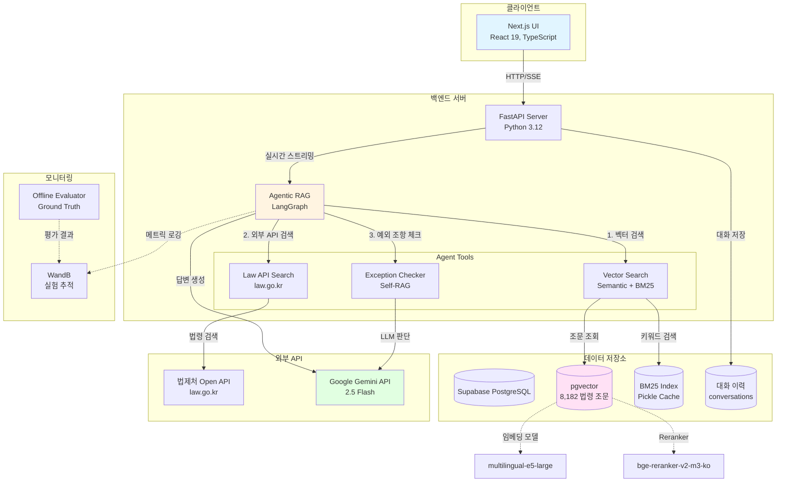
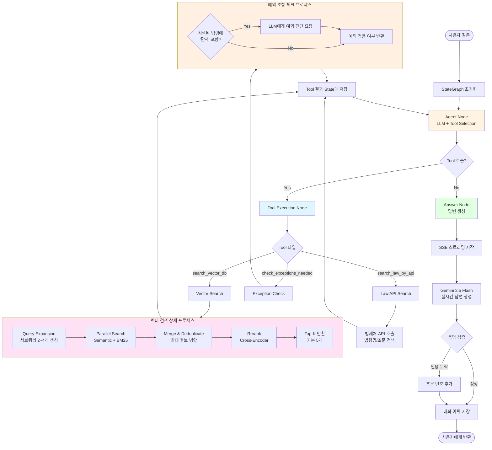
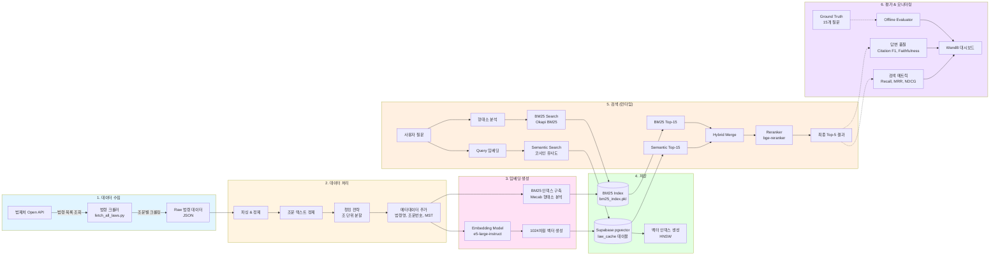
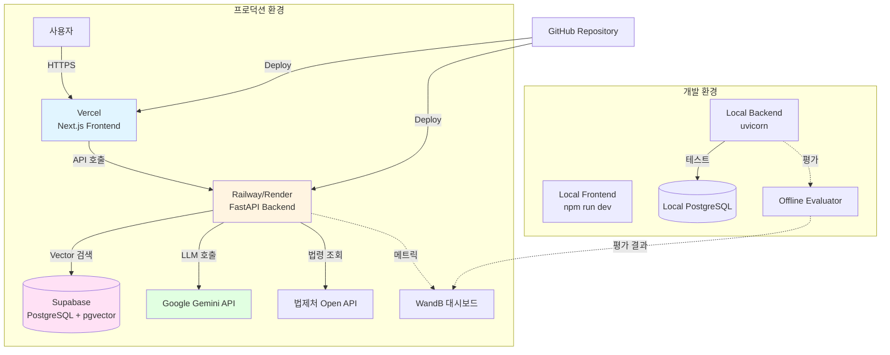

# 시스템 아키텍처

## 1. 전체 시스템 아키텍처



## 2. Agentic RAG 실행 플로우



## 3. 데이터 파이프라인 아키텍처



## 4. 핵심 컴포넌트 상세

### 4.1 Vector Search (Hybrid Retrieval)

**특징**:
- **Semantic Search**: multilingual-e5-large-instruct (1024-dim)
- **BM25 Search**: Okapi BM25 with Mecab tokenizer
- **Reranker**: BGE Reranker v2-m3 Korean
- **Fusion**: Semantic + BM25 병합 후 Rerank

**성능**:
- 검색 대상: 8,182개 조문
- 평균 검색 시간: 200~300ms
- Recall@5: 45% (현재) → 90% (목표)

### 4.2 Agentic RAG (LangGraph)

**구조**:
- **State**: AgentState (typed dict with messages, context, retrieved_docs)
- **Nodes**: Agent Node, Tool Node, Answer Node
- **Tools**: 3개 (vector_search, law_api_search, check_exceptions)
- **LLM**: Gemini 2.5 Flash

**실행 흐름**:
1. Agent가 Tool 선택 (LLM 판단)
2. Tool 병렬 실행 (ThreadPoolExecutor)
3. 결과를 State에 누적
4. Agent가 추가 Tool 필요 여부 판단
5. 충분한 정보 수집 시 답변 생성

### 4.3 Self-RAG (예외 조항 체크)

**목적**:
- 법령의 "단서" 조항 (예: "다만, ...", "단, ...") 자동 감지
- 사용자 상황이 예외에 해당하는지 LLM 판단

**예시**:
```
질문: "5인 미만 사업장에서 해고 예고수당 받을 수 있어?"

근로기준법 제11조: "이 법은 상시 5명 이상의 근로자를 사용하는 모든 사업 또는 사업장에 적용한다. 다만, ..."

→ check_exceptions_needed() 호출
→ LLM 판단: "5인 미만은 예외에 해당, 제11조 적용 제외"
→ 정확한 답변 생성
```

### 4.4 데이터베이스 스키마

**law_cache 테이블** (Supabase):
```sql
CREATE TABLE law_cache (
    id BIGSERIAL PRIMARY KEY,
    law_name TEXT NOT NULL,           -- 법령명
    article TEXT,                      -- 조문 번호 (예: "제750조")
    mst TEXT,                          -- 법령 고유 ID
    title TEXT,                        -- 조문 제목
    content TEXT,                      -- 조문 내용
    embedding VECTOR(1024),            -- 임베딩 벡터
    created_at TIMESTAMPTZ DEFAULT NOW()
);

CREATE INDEX idx_law_cache_embedding ON law_cache
USING hnsw (embedding vector_cosine_ops);

CREATE INDEX idx_law_name_article ON law_cache(law_name, article);
```

**conversations 테이블**:
```sql
CREATE TABLE conversations (
    id UUID PRIMARY KEY DEFAULT uuid_generate_v4(),
    messages JSONB NOT NULL,           -- 대화 메시지 배열
    created_at TIMESTAMPTZ DEFAULT NOW()
);
```

## 5. 성능 최적화

### 5.1 검색 최적화
- **HNSW 인덱스**: 벡터 검색 O(log N) 시간 복잡도
- **BM25 캐시**: Pickle 직렬화로 빠른 로딩 (1초 이내)
- **병렬 검색**: Semantic + BM25 동시 실행 (ThreadPoolExecutor)
- **Reranking**: 상위 후보만 Cross-Encoder 적용 (비용 절감)

### 5.2 LLM 최적화
- **스트리밍**: SSE로 실시간 답변 전송 (UX 개선)
- **모델 선택**:
  - 답변 생성: Gemini 2.5 Flash - 빠르고 정확
  - Query Expansion: Gemini 2.5 Flash Lite - 초경량
- **프롬프트 캐싱**: 반복적인 시스템 프롬프트 캐싱 (비용 절감)

### 5.3 인프라 최적화
- **Supabase Edge Functions**: 서버리스 배포
- **pgvector**: PostgreSQL 네이티브 벡터 검색 (별도 벡터 DB 불필요)
- **BM25 메모리 캐싱**: 8,182 문서 인덱스를 메모리 상주

## 6. 모니터링 & 평가

### 6.1 실시간 모니터링 (WandB)
- **검색 메트릭**: 검색 시간, 결과 수, Top 유사도
- **LLM 메트릭**: 토큰 사용량, API 호출 횟수, 응답 시간
- **Agent 메트릭**: Tool 호출 횟수, 검색 반복 횟수

### 6.2 오프라인 평가 (Ground Truth)
- **데이터셋**: 15개 테스트 질문 (상황별, 난이도별)
- **평가 지표**:
  - Retrieval: Recall@3/5/10, MRR, NDCG@3
  - Generation: Citation F1, Faithfulness, Relevance
  - Cost: 응답 시간, 토큰 수
- **자동 평가**: CI/CD 파이프라인 통합 가능

### 6.3 현재 성능 (2026-01-04 평가)
| Metric | 값 | 목표 |
|--------|-----|------|
| Recall@3 | 35% | 80% |
| Recall@5 | 45% | 90% |
| Recall@10 | 50% | 95% |
| Citation F1 | 30% | 80% |
| 평균 응답 시간 | 113초 | 60초 |

## 7. 기술 스택

### Backend
- **Language**: Python 3.12
- **Framework**: FastAPI 0.104+
- **Agent**: LangGraph 1.0.4
- **LLM**: Google Gemini API (2.5 Flash)
- **Embedding**: multilingual-e5-large-instruct
- **Reranker**: bge-reranker-v2-m3-ko
- **BM25**: rank-bm25 + Kiwi (한국어 형태소 분석기)

### Frontend
- **Framework**: Next.js 16.0
- **Language**: TypeScript
- **UI**: React 19, Tailwind CSS
- **State**: React Query, Context API

### Infrastructure
- **Database**: Supabase (PostgreSQL + pgvector)
- **Deployment**: HuggingFace Spaces (Backend), Vercel (Frontend)
- **Monitoring**: WandB
- **Version Control**: Git + GitHub

### External APIs
- **Law Data**: 법제처 Open API (law.go.kr)
- **LLM**: Google Gemini API
- **Embedding**: Hugging Face models (self-hosted)

## 8. 배포 아키텍처



## 9. 보안 & 권한

### API 키 관리
- **환경 변수**: `.env` 파일 (Git 제외)
- **Supabase**: Row Level Security (RLS) 적용
- **CORS**: 허용된 도메인만 API 접근

### 데이터 보호
- **대화 이력**: UUID 기반 익명화
- **개인정보**: 수집하지 않음 (법률 상담 내용만 저장)
- **HTTPS**: 모든 통신 암호화

## 10. 확장성

### 수평 확장
- **Backend**: 무상태(stateless) 서버로 설계 → 여러 인스턴스 배포 가능
- **Database**: Supabase 자동 스케일링
- **LLM API**: Rate limit 내에서 병렬 호출

### 수직 확장
- **벡터 인덱스**: 100만 개 조문까지 확장 가능 (현재 8천 개)
- **BM25**: 메모리 허용 범위 내 무제한
- **캐싱**: Redis 도입으로 검색 결과 캐싱 가능

---

**작성일**: 2026-01-04
**버전**: 1.0
**작성자**: Claude Sonnet 4.5
