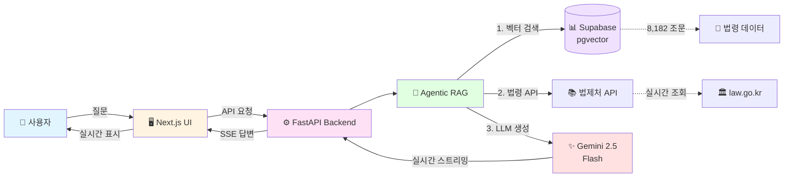

# 아키텍처 개요 (간단 버전)

README용 간단한 아키텍처 다이어그램

## 핵심 흐름

1. **사용자 질문** → Next.js UI
2. **API 요청** → FastAPI Backend
3. **Agent 실행** → LangGraph State Machine
4. **벡터 검색** → Supabase pgvector (8,182 조문)
5. **LLM 답변** → Gemini 2.5 Flash
6. **실시간 스트리밍** → SSE로 사용자에게 전달

## 주요 기술

- **Frontend**: Next.js 15 + React 19 + TypeScript
- **Backend**: FastAPI + Python 3.12
- **Agent**: LangGraph (Agentic RAG)
- **LLM**: Google Gemini 2.5 Flash
- **Vector DB**: Supabase (PostgreSQL + pgvector)
- **Embedding**: multilingual-e5-large-instruct
- **Reranker**: bge-reranker-v2-m3-ko
- **BM25**: Mecab + rank-bm25

## 성능 지표

- **검색 시간**: ~250ms (벡터 + BM25 + Rerank)
- **응답 시간**: ~60-120초 (LLM 생성 포함)
- **검색 대상**: 8,182개 법령 조문
- **Recall@5**: 45% (현재) → 90% (목표)
